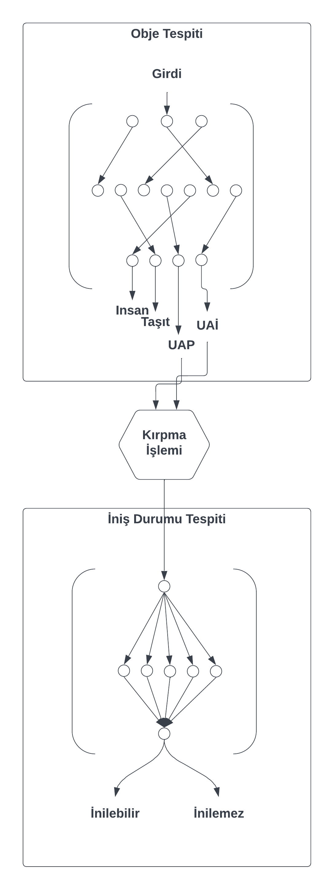

# Teknofest Competition 
This repo is created in order to compete in Teknofest 2022 Artificial Intelligence in Transportation competetion and mainly focused on Object Detection of 4 classes: [Human, Vehicle, Emergency Ambulance Landing, Drone Landing] and classification of landing statuses whether available or not.


# Abstract
With the integration of flying cars and drone technologies into human life, object detection using the bottom view cameras of these systems has gained critical importance. Unlike classical object detection problems, these autonomous systems need to detect in real time, in different environmental conditions and at high altitudes. The system we developed to solve this problem is TPH-YOLOv5, which is proposed as a solution to the VisDrone problem.
combines this with a CNN model. By training this combined system with our dataset of 16000 images, we were able to reach 0.846 mAP on the 2nd session data provided by the competition committee.


# Paper
```Inside the repo, access Teknofest_Final_Design_Report.pdf to read more about the project.```


# Class Distribution
Most of the classes are human and vehicles. Landing places are rare, that was a huge handicap for the project.


# Dataset
Multiple sources have used for data gathering. However, most of our collection consists of the videos that we have taken at METU campus.


# Architecture
Model architecture is shown below.



# Results
Results are shown below.  


# Comparison

YOLOv5 |
 | TPH 


# CNN Results

